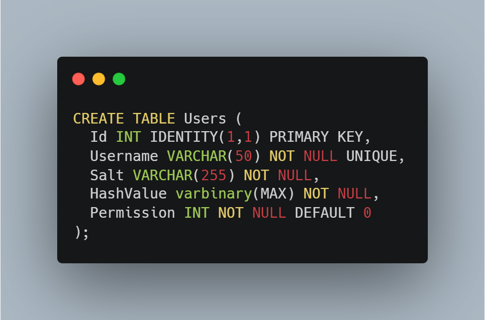
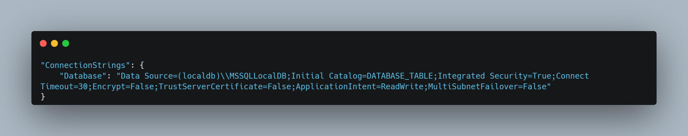
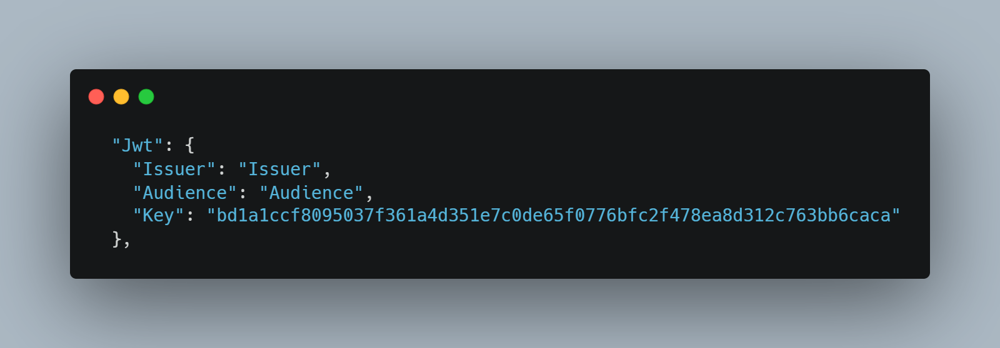
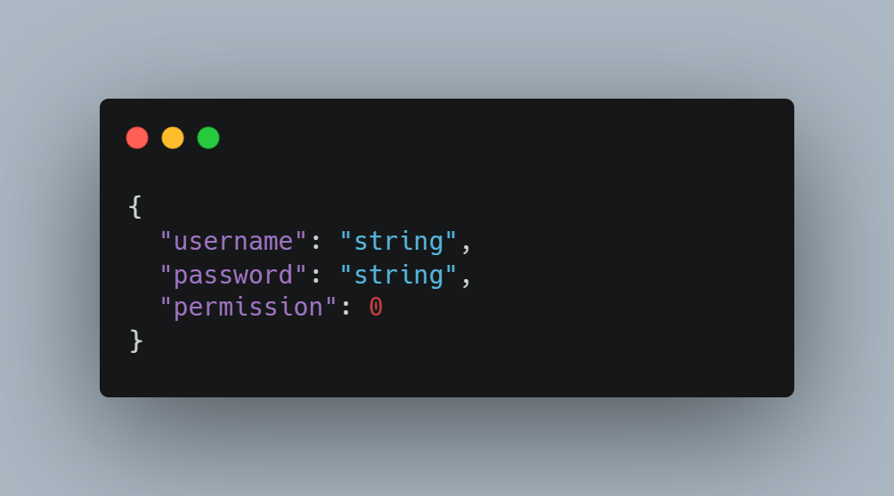
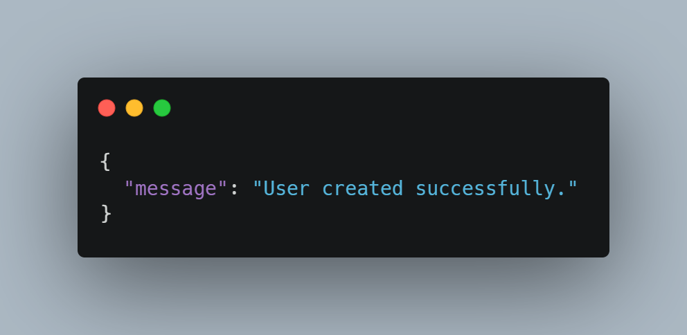
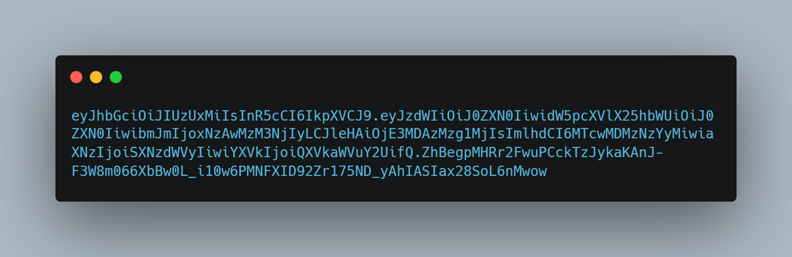
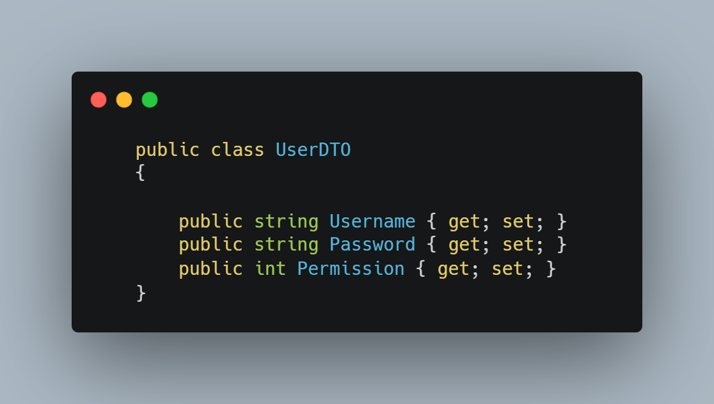
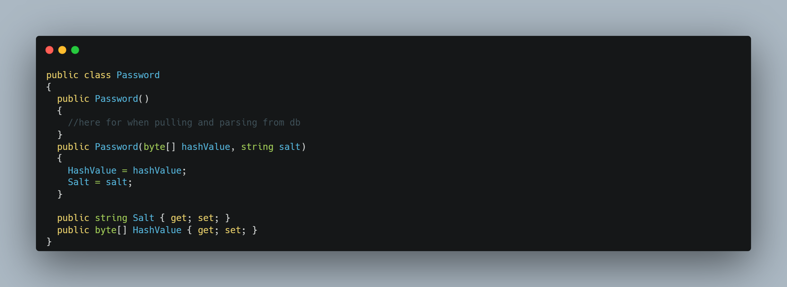
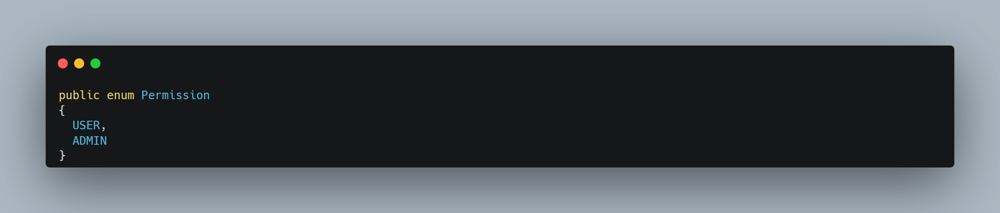

- [Summary](#authentication-api)
- [Authentication](#authentication)
- [Setup](#setup)
  * [Prerequisites](#prerequisites)
  * [Database Setup](#database-setup)
  * [Configuration](#configuration)
    + [Connection String](#connection-string)
    + [JWT Settings](#jwt-settings)
  * [Troubleshooting](#troubleshooting)
- [Versioning](#versioning)
  * [1.1.0](#110)
  * [1.0.0](#100)
- [Endpoints](#endpoints)
  * [/CreateUser](#-createuser)
    + [*Description:*](#-description--)
    + [Request Body](#request-body)
    + [Response Body](#response-body)
  * [/AuthenticateUser](#-authenticateuser)
    + [*Description:*](#-description---1)
    + [Request Body](#request-body-1)
    + [Response Body](#response-body-1)
- [Data Models](#data-models)
  * [User](#user)
  * [UserDTO (Data Transfer Object)](#userdto--data-transfer-object-)
  * [Password](#password)
  * [Permission Enum](#permission-enum)
- [Authentication API Roadmap](#authentication-api-roadmap)
  * [Phase 1: Core Authentication Functionality](#phase-1--core-authentication-functionality)
  * [Phase 2: Enhanced Security and Integration](#phase-2--enhanced-security-and-integration)
  * [Phase 3: Scalability and Performance Optimization](#phase-3--scalability-and-performance-optimization)
- [How to implement authentication to an endpoint (open source users)](#how-to-implement-authentication-to-an-endpoint--open-source-users-)
- [References](#references)

<small><i><a href='http://ecotrust-canada.github.io/markdown-toc/'>Table of contents generated with markdown-toc</a></i></small>

# Authentication API

An authentication API is a crucial component of any secure application, providing a mechanism for users to prove their identity and access authorized resources. It typically involves a user registration process where users create an account and provide credentials such as a username and password. Upon subsequent login attempts, users submit their credentials to the API, which validates them against the stored information. If the credentials are valid, the API issues an authentication token, which serves as a proof of identity for the user during subsequent interactions with the application. This token allows the user to access authorized resources without having to repeatedly provide their credentials, ensuring a seamless and secure user experience.

An authentication API typically employs various security measures to protect user credentials and prevent unauthorized access. These measures may include password hashing, token expiration, and secure communication protocols. By implementing robust authentication mechanisms, applications can safeguard sensitive user data and maintain a high level of security.

# Authentication
When a user attempts to log in to the C# REST API, they provide their username and password. The API first retrieves the user's salt from the database. Then, it hashes the input password using the same hashing algorithm and salt combination that was used when the password was originally stored. Finally, the API compares the computed hash to the stored hash. If the hashes match, the user is authenticated and granted access to the API. This process ensures that passwords are never stored in plain text and that even if an attacker gains access to the database, they will not be able to recover the user's password.

# Setup

## Prerequisites
- [Microsoft SQL Management Studio](https://learn.microsoft.com/en-us/sql/ssms/download-sql-server-management-studio-ssms?view=sql-server-ver16)

## Database Setup
Run the following query in your database to follow the API.

## Configuration
### Connection String
If you are running this API locally or on your own cloud environment you need to edit the configuration, in *appsettings.json*, you will want to change the connection string to your database table.

### JWT Settings
In the *appsettings.json* file there is a section for JWT configuration, you will want to change everything in here

- Issuer: The party that "created" the token and signed it with it's private key. *Anyone can create tokens, make sure that the tokens you receive is created by a party that you trust.*
- Audience: In the JSON Web Token (JWT) standard, the "aud" (audience) claim is a string or array of strings that identifies the recipients that the JWT is intended for. This can be a specific application, a set of applications, or the general public. The "aud" claim is used to prevent JWT token abuse, and to provide some basic information about the context in which the JWT was issued. The "aud" claim is a mandatory claim, and must be included in every JWT. The value of the "aud" claim must be a string or array of strings that is registered with the authorization server. The authorization server can then use the "aud" claim to verify the validity of the JWT, and to determine which client or clients are allowed to access the protected resources.
- Key: In the JSON Web Token (JWT) standard, the "kid" (key ID) claim is a string that indicates the key that was used to digitally sign the JWT. This is used to verify the authenticity and integrity of the JWT, and to prevent JWT token abuse
 

Notes: The key used in this tutorial are randomly generated for example purposes, Do not use this for the production environment.

## Troubleshooting
For any troubleshooting needs please feel free to shoot me an email bradystohler15@gmail.com or go to my website and use the "Contact Me" section.

# Versioning
## 1.1.0
- "/AuthenticateUser" endpoint has been updated to return a JWT or Unauthorized instead of a boolean.
- Add UserDTO object to pass parameters from body in controllers.
- Since I added JWT authentication the [Authorize] attribute can be added to endpoints to require a user to be authorized.
- Added a section to the documentation to show open source users how to implement authorization to an endpoint using JWTs
- Update documentation
## 1.0.0
The initial commit, this contains the two original endpoints of "/CreateUser" & "/AuthenticateUser"

# Endpoints

## /CreateUser

### *Description:*
Creates a new user in the database.

### Request Body

### Response Body

## /AuthenticateUser

### *Description:*
This endpoint validates the provided username and password against the corresponding hash and salt stored in the database. Upon successful authentication, a JSON Web Token (JWT) is issued, granting access to authorized resources. Otherwise, an Unauthorized response is returned to indicate invalid credentials.

### Request Body

### Response Body
- Authentication successful

- Authentication unsuccessful

[401 - Http Response](https://developer.mozilla.org/en-US/docs/Web/HTTP/Status/401)

# Data Models

## User

## UserDTO (Data Transfer Object)

## Password

## Permission Enum

# Authentication API Roadmap

## Phase 1: Core Authentication Functionality

- <del>Establish user authentication mechanisms: Implement user registration, login,</del> and logout endpoints.

- <del>Secure password storage: Store user passwords using a secure hashing algorithm and unique salts to prevent plain-text storage and unauthorized access.

- <del>Implement token-based authentication: Utilize JSON Web Tokens (JWTs) to maintain user authentication sessions and provide secure access to protected resources.

- Enable role-based access control (RBAC): Define user roles and permissions to restrict access to specific API endpoints based on user authorization levels.

## Phase 2: Enhanced Security and Integration

- Adopt OAuth 2.0 protocol: Integrate with external OAuth providers to enable seamless authentication and authorization for third-party applications.

- Support OpenID Connect (OIDC): Implement OpenID Connect as an identity layer to provide user profile data and claims for personalized experiences.

## Phase 3: Scalability and Performance Optimization

- Implement caching mechanisms: Utilize caching strategies to improve API response times and reduce database load.

- Optimize resource utilization: Employ techniques to optimize memory usage, CPU usage, and database queries for efficient API performance.

- Monitor and analyze API usage: Implement monitoring tools to track API usage patterns, identify bottlenecks, and optimize performance accordingly.

- Consider cloud-based deployment: Explore cloud-based hosting solutions to scale the API infrastructure and handle increased traffic.

# How to implement authentication to an endpoint (open source users)

# References
[Mojo Auth](https://mojoauth.com/glossary/)