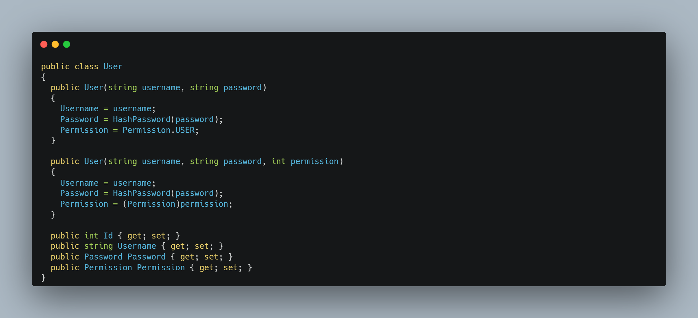

<!-- TOC start (generated with https://github.com/derlin/bitdowntoc) -->
# Table Of Contents
- [Summary](#authentication-api)
- [Authentication](#authentication)
- [Versioning](#versioning)
   * [1.0.0](#100)
- [Endpoints](#endpoints)
   * [/CreateUser](#createuser)
      + [*Description:*](#description)
      + [Request Body](#request-body)
      + [Response Body](#response-body)
   * [/AuthenticateUser](#authenticateuser)
      + [*Description:*](#description-1)
      + [Request Body](#request-body-1)
      + [Response Body](#response-body-1)
- [Data Models](#data-models)
   * [User](#user)
   * [Password](#password)
   * [Permission Enum](#permission-enum)
- [Authentication API Roadmap](#authentication-api-roadmap)
   * [Phase 1: Core Authentication Functionality](#phase-1-core-authentication-functionality)
   * [Phase 2: Enhanced Security and Integration](#phase-2-enhanced-security-and-integration)
   * [Phase 3: Scalability and Performance Optimization](#phase-3-scalability-and-performance-optimization)

<!-- TOC end -->

<!-- TOC -->
# Authentication API

An authentication API is a crucial component of any secure application, providing a mechanism for users to prove their identity and access authorized resources. It typically involves a user registration process where users create an account and provide credentials such as a username and password. Upon subsequent login attempts, users submit their credentials to the API, which validates them against the stored information. If the credentials are valid, the API issues an authentication token, which serves as a proof of identity for the user during subsequent interactions with the application. This token allows the user to access authorized resources without having to repeatedly provide their credentials, ensuring a seamless and secure user experience.

An authentication API typically employs various security measures to protect user credentials and prevent unauthorized access. These measures may include password hashing, token expiration, and secure communication protocols. By implementing robust authentication mechanisms, applications can safeguard sensitive user data and maintain a high level of security.

<!-- TOC -->
# Authentication
When a user attempts to log in to the C# REST API, they provide their username and password. The API first retrieves the user's salt from the database. Then, it hashes the input password using the same hashing algorithm and salt combination that was used when the password was originally stored. Finally, the API compares the computed hash to the stored hash. If the hashes match, the user is authenticated and granted access to the API. This process ensures that passwords are never stored in plain text and that even if an attacker gains access to the database, they will not be able to recover the user's password.

# Setup
## Prerequisites
- [Microsoft SQL Management Studio](https://learn.microsoft.com/en-us/sql/ssms/download-sql-server-management-studio-ssms?view=sql-server-ver16)
## Database Setup
Run the following query in your database to follow the API.

## Configuration
If you are running this API locally or on your own cloud environment you need to edit the configuration, in *appsettings.json*, you will want to change the connection string to your database table.

## Troubleshooting
For any troubleshooting needs please feel free to shoot me an email bradystohler15@gmail.com or go to my website and use the "Contact Me" section.
<!-- TOC -->
# Versioning
<!-- TOC -->
## 1.0.0
The initial commit, this contains the two original endpoints of "/CreateUser" & "/AuthenticateUser"

<!-- TOC -->
# Endpoints
<!-- TOC -->
## /CreateUser
<!-- TOC -->
### *Description:*
Creates a new user in the database.
<!-- TOC -->
### Request Body

<!-- TOC -->
### Response Body

<!-- TOC -->
## /AuthenticateUser
<!-- TOC -->
### *Description:*
This endpoint authenticates the username and password to the hash and salt in the database
<!-- TOC -->
### Request Body

<!-- TOC -->
### Response Body

<!-- TOC -->
# Data Models
<!-- TOC -->
## User

<!-- TOC -->
## Password

<!-- TOC -->
## Permission Enum

<!-- TOC -->
# Authentication API Roadmap

<!-- TOC -->
## Phase 1: Core Authentication Functionality

- <del>Establish user authentication mechanisms: Implement user registration, login,</del> and logout endpoints.

- <del>Secure password storage: Store user passwords using a secure hashing algorithm and unique salts to prevent plain-text storage and unauthorized access.

- Implement token-based authentication: Utilize JSON Web Tokens (JWTs) to maintain user authentication sessions and provide secure access to protected resources.

- Enable role-based access control (RBAC): Define user roles and permissions to restrict access to specific API endpoints based on user authorization levels.

<!-- TOC -->
## Phase 2: Enhanced Security and Integration

- Adopt OAuth 2.0 protocol: Integrate with external OAuth providers to enable seamless authentication and authorization for third-party applications.

- Support OpenID Connect (OIDC): Implement OpenID Connect as an identity layer to provide user profile data and claims for personalized experiences.

<!-- TOC -->
## Phase 3: Scalability and Performance Optimization

- Implement caching mechanisms: Utilize caching strategies to improve API response times and reduce database load.

- Optimize resource utilization: Employ techniques to optimize memory usage, CPU usage, and database queries for efficient API performance.

- Monitor and analyze API usage: Implement monitoring tools to track API usage patterns, identify bottlenecks, and optimize performance accordingly.

- Consider cloud-based deployment: Explore cloud-based hosting solutions to scale the API infrastructure and handle increased traffic.

# Authentication API

An authentication API is a crucial component of any secure application, providing a mechanism for users to prove their identity and access authorized resources. It typically involves a user registration process where users create an account and provide credentials such as a username and password. Upon subsequent login attempts, users submit their credentials to the API, which validates them against the stored information. If the credentials are valid, the API issues an authentication token, which serves as a proof of identity for the user during subsequent interactions with the application. This token allows the user to access authorized resources without having to repeatedly provide their credentials, ensuring a seamless and secure user experience.

An authentication API typically employs various security measures to protect user credentials and prevent unauthorized access. These measures may include password hashing, token expiration, and secure communication protocols. By implementing robust authentication mechanisms, applications can safeguard sensitive user data and maintain a high level of security.

# Authentication
When a user attempts to log in to the C# REST API, they provide their username and password. The API first retrieves the user's salt from the database. Then, it hashes the input password using the same hashing algorithm and salt combination that was used when the password was originally stored. Finally, the API compares the computed hash to the stored hash. If the hashes match, the user is authenticated and granted access to the API. This process ensures that passwords are never stored in plain text and that even if an attacker gains access to the database, they will not be able to recover the user's password.

# Versioning
## 1.0.0
The initial commit, this contains the two original endpoints of "/CreateUser" & "/AuthenticateUser"

# Endpoints
## /CreateUser
### *Description:*
Creates a new user in the database.
### Request Body

### Response Body

## /AuthenticateUser
### *Description:*
This endpoint authenticates the username and password to the hash and salt in the database
### Request Body

### Response Body

# Data Models
## User

## Password

## Permission Enum

# Authentication API Roadmap

## Phase 1: Core Authentication Functionality

- <del>Establish user authentication mechanisms: Implement user registration, login,</del> and logout endpoints.

- <del>Secure password storage: Store user passwords using a secure hashing algorithm and unique salts to prevent plain-text storage and unauthorized access.

- Implement token-based authentication: Utilize JSON Web Tokens (JWTs) to maintain user authentication sessions and provide secure access to protected resources.

- Enable role-based access control (RBAC): Define user roles and permissions to restrict access to specific API endpoints based on user authorization levels.

## Phase 2: Enhanced Security and Integration

- Adopt OAuth 2.0 protocol: Integrate with external OAuth providers to enable seamless authentication and authorization for third-party applications.

- Support OpenID Connect (OIDC): Implement OpenID Connect as an identity layer to provide user profile data and claims for personalized experiences.

## Phase 3: Scalability and Performance Optimization

- Implement caching mechanisms: Utilize caching strategies to improve API response times and reduce database load.

- Optimize resource utilization: Employ techniques to optimize memory usage, CPU usage, and database queries for efficient API performance.

- Monitor and analyze API usage: Implement monitoring tools to track API usage patterns, identify bottlenecks, and optimize performance accordingly.

- Consider cloud-based deployment: Explore cloud-based hosting solutions to scale the API infrastructure and handle increased traffic.